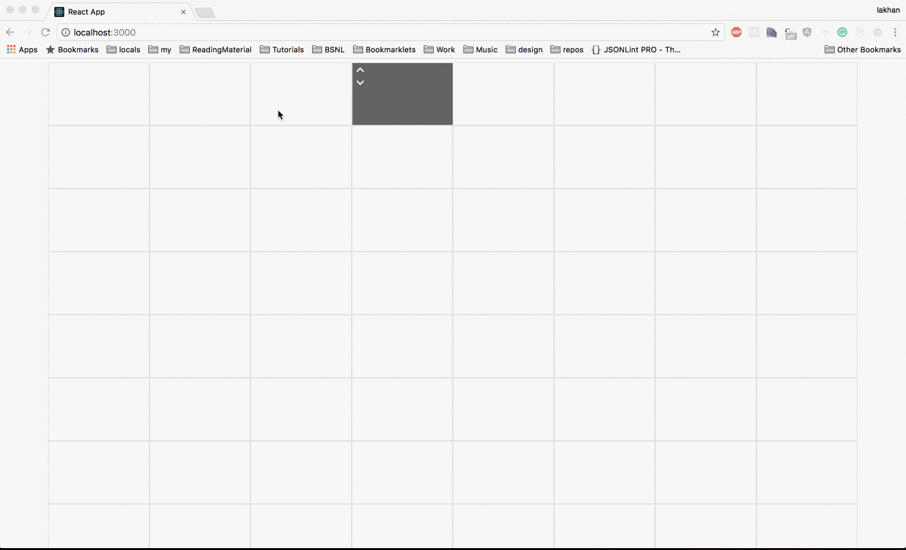

# Dynamic-Grid-Builder
ReactJS Dynamic Grid component built using [Bootstrap](http://getbootstrap.com/) and [ReactJS](https://facebook.github.io/react/). Component has resizeable and repositionable placholder which can be used to perform various events on grid.

* Include `bootstrap.css` in your `index.html` file
* `npm install --save grid-maker`

```
import Grid from 'grid-maker';
import React from 'react';
class MyComponent extends React.Component {
	render () {
		const rows = [1,2,3,4,5];
		const columns = [1,2,3,4,5];
		return (
			<Grid rows={rows} columns={columns} />
		)
	}
}

```

## Demo


